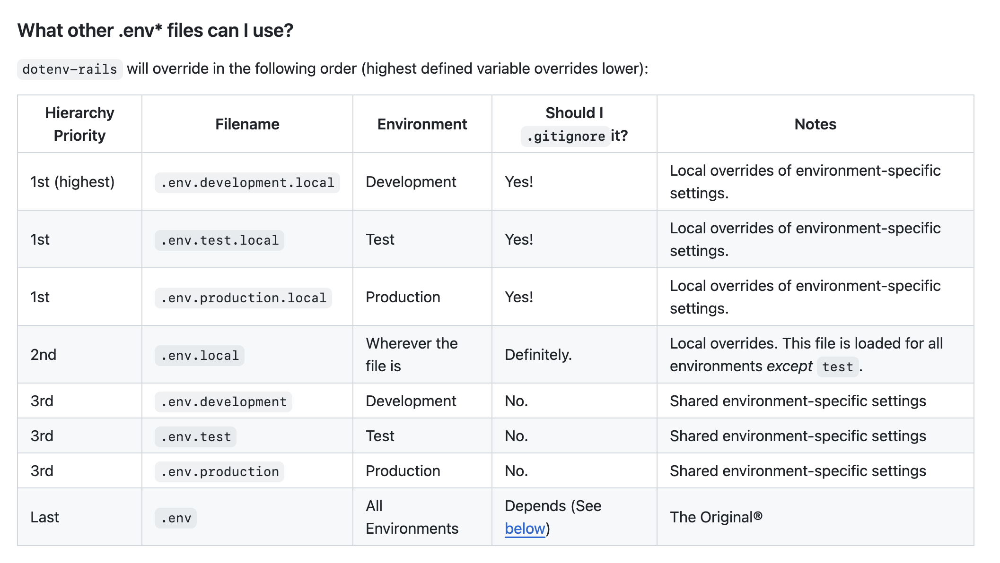

# Welcome to React Native Training

By, Lakhan Samani<br/>
Handle: lakhansamani<br/>
Email: lakhan.m.samani@gmail.com

<div class="pt-12">
  <span @click="$slidev.nav.next" class="px-2 py-1 rounded cursor-pointer" hover="bg-white bg-opacity-10">
    Press Space for next page <carbon:arrow-right class="inline"/>
  </span>
</div>

<div class="abs-br m-6 flex gap-2">
  <a href="https://github.com/lakhansamani" target="_blank" alt="GitHub" title="Open in GitHub"
    class="text-xl slidev-icon-btn opacity-50 !border-none !hover:text-white">
    <carbon-logo-github />
  </a>
</div>

<!--
The last comment block of each slide will be treated as slide notes. It will be visible and editable in Presenter Mode along with the slide. [Read more in the docs](https://sli.dev/guide/syntax.html#notes)
-->

---

# Agenda

<Toc maxDepth="1"></Toc>

---

# What is React Native

- Cross platfrom mobile application development
- Written in JavaScript—rendered with native code
- Two ways to run react-native applications
  - Expo (Easy to get started and implement business logic)
  - React Native CLI

---

# Env Setup

- Install Expo Go on your mobile (https://docs.expo.dev/get-started/expo-go/)
- Install React Native Tools By microsoft in your vscode

---

# Setting up our first project

```sh
npx create-expo-app -t expo-template-blank-typescript MyApp
```

For using `react-native-cli`

- There is a nice boilerplate:

```sh
npx react-native@latest init MyApp --template @thecodingmachine/react-native-boilerplate
```

---

# Understanding project structure

- app.json - Manifest file
- App.tsx - entry point

---

# Core Components

- ActivityIndicator
- Alert
- Button
- FlatList
- Image
- ImageBackground
- Modal
- Pressable
- RefreshControl (Pull refresh)
- SectionList

---

- StatusBar
- Switch
- Text
- TextInput
- VirtualizedList
- Dimensions
- Animated

---

- ListView
- KeyboardAvoidingView
- ScrollView
- SafeAreaView
- View

Ref: https://reactnative.dev/docs/components-and-apis

---

# Android Specific

- BackHandler
- DrawerLayoutHandler
- PermissionsAndroid
- ToastAndroind

---

# iOS Specific

- ActionSheetIOS

---

# Navigation

```sh
npm install @react-navigation/native
npx expo install react-native-screens react-native-safe-area-context

OR

npm install react-native-screens react-native-safe-area-context #for react-native-cli
```

Ref: https://reactnavigation.org/

---

# Exercise

- Build invoice APP

---

# Exercise

- Build custom component for rendering any given list

  - List item type could be anything (Use generics for that)
  - Conditionally render Horizontal / Vertical list
  - Allow setting onPressItem method of each item on the list

  ```jsx
    exampleResponse = {
      orientation: 'horizontal',
      items: [{
        id:1,
        image:'',
        title: ''
      }, {
        id:2,
        image:'',
        title:''
      }],
    }
    <ImageItem id image title>
    <CustomList
      orientation=""
      items={exampleResponse.items}
      onPressItem={}
      itemView={(item) => <ImageItem id={item.id} image={item.image} title/>}}
    />

    <>
      <Presseable onPress={() => {
        props.onPressItem(item)
      }}>
    </>

  ```

---

# Using Location

```
npx expo install expo-location
```

Ref: https://docs.expo.dev/versions/latest/sdk/location/

---

# Using env

For expo build, use

`EXPO_PUBLIC_` prefix

How to access variable?

- `process.env.VARIABLE_NAME`

---

# Using env for local development

- Create .env files to manage multiple env on local
  

---

# Adding to eas.json

```json
{
  "build": {
    "production": {
      "env": {
        "EXPO_PUBLIC_API_URL": "https://api.production.com"
      }
    },
    "test": {
      "env": {
        "EXPO_PUBLIC_API_URL": "https://api.test.com"
      }
    }
  }
}
```

---

# Using app.config.js

For dynamic configurations and env based configs you can use app.config.js instead of
app.json

All you have to do is rename `app.json` -> `app.config.js` and use `module.exports` to export config

example:

```js
module.exports = {
  // use the variable if it's defined, otherwise use the fallback
  icon: process.env.APP_ICON || './assets/icon.png',
  name: process.env.APP_NAME || 'My App',
};
```

---

# Using secrets

This is specific to eas builds(expo)

```sh
eas secret:create --scope project --name SECRET_NAME --value secretvalue --type string
```

---

# Builds

```
eas login
eas init
eas build --platform android --local
eas build --platform ios --local
```

---

# Using eas.json

```json
{
  "build": {
    "development": {
      "developmentClient": true,
      "distribution": "internal",
      "env": {
        "EXPO_PUBLIC_AUTH_API": "https://horizontal-api-training-production.up.railway.app",
        "EXPO_PUBLIC_GQL_API": "https://horizontail-training-api.up.railway.app/v1/graphql"
      }
    },
    "preview": {
      "distribution": "internal"
    },
    "production": {}
  }
}
```

---

# Patches

To fix the node_modules error temporarily till author fixes it

- Fix broken file in node_modules
- Run patch command
  `npx patch-package some-package`
- Add post install script
  - `"postinstall": "patch-package"`
